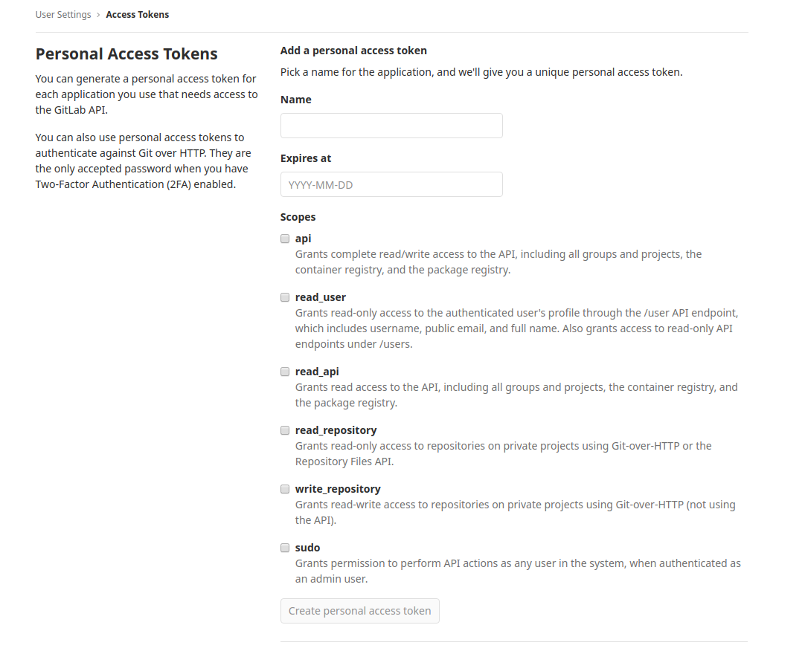

# Development

This integration focuses on the [GitLab](https://about.gitlab.com/) and is using
[GitLab API](https://docs.gitlab.com/ee/api/) for interacting with the GitLab
platform.

## Prerequisites

The current version of this integration focuses on using GitLab in self-hosted
environment.

There are several choices when it comes to the installation the GitLab, which
are covered here [ways of installing GitLab](https://about.gitlab.com/install/).

## Provider account setup

### GitLab

To setup a GitLab account for development, please take the following steps:

1. Visit the [GitLab installation](https://about.gitlab.com/install/) section
   and install the software using your method of choice.
2. The very first time you visit GitLab (depending on where it is installed, if
   locally you can visit it by navigating to http://localhost/), you will be
   asked to set up the admin password.
3. After you enter the admin password, you can login with username "**root**"
   and the password you set up.

## Authentication

Once you've created your account, you'll need to generate an API Key to access
the GitLab API.

1. First, click on your avatar (top-right) and select "Settings". Alternatively,
   access it by using host-url/profile (e.g. http://localhost/profile).
2. From the left side menu, select "Access Tokens".
3. Add a new personal access token by giving it a name, expiration (optional) as
   well as selecting the usage permissions based on your usecase. Then click
   "Create person access token" below.
   
4. You'll see your newly generated API key at the top of the page underneath
   "Your New Personal Access Token" field. It's shown only once, so make sure to
   save it somewhere or you'll need to re-create it again later.
5. Copy the API Key, create a `.env` file at the root of this project, and set
   an `API_KEY` variable with the copied value.

```bash
PERSONAL_TOKEN="paste the api key here"
```

6. Final step is to also include the hostname in the `.evn` file. For example,
   if it's localhost, simply add it to the .env in this way.

```bash
PERSONAL_TOKEN="paste the api key here"
BASE_URL="your hostname (e.g. localhost)"
```

After following the above steps, you should now be able to start contributing to
this integration. The integration will pull in the `PERSONAL_TOKEN` and
`BASE_URL` variables from the `.env` file and use them when making requests.
